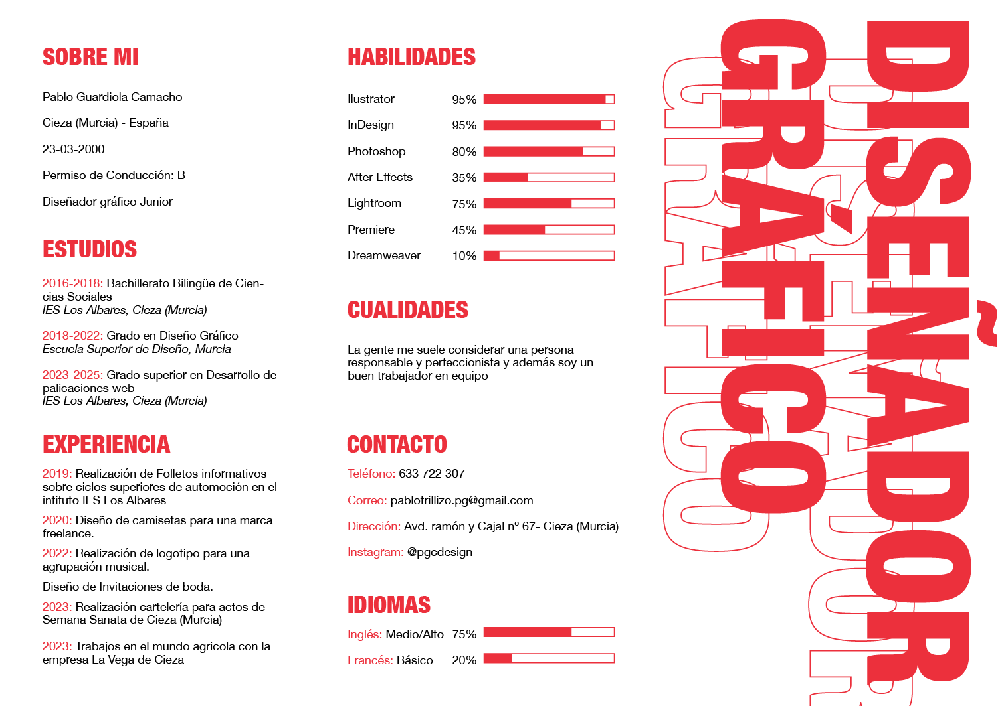

# Pablo Guardiola Camacho

Hola, mi nombre es Pablo Guardiola Camacho y soy un **Diseñador Gráfico Junior** con ganas de trabajar y seguir formándome.

En esta página web mostraré imágenes de algunos de mis proyectos realizados y explicaré brevemente en que consistían a modo de portfolio.

Pero como primer paso aquí muestro mi curriculum:

## PROYECTOS

Como se podrá comprobar a continuación la rama que más llama mi atención del diseño gráfico es la editorial, pero en todas soy capaz de trabajar y llevar a cabo proyectos de diversas envergaduras.

### Pixel

### Colección de libros "Clásicos del misterio"

### Maravedí

### La Lista

>ADEMÁS
>
>También me gusta mucho la ilustración y la fotografía, de las cuales veremos algunos ejemplos a continuación.

## ILUSTRACIÓN

## FOTOGRAFÍA

